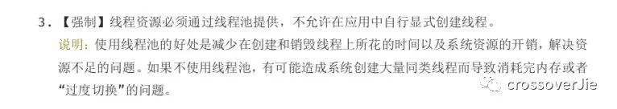
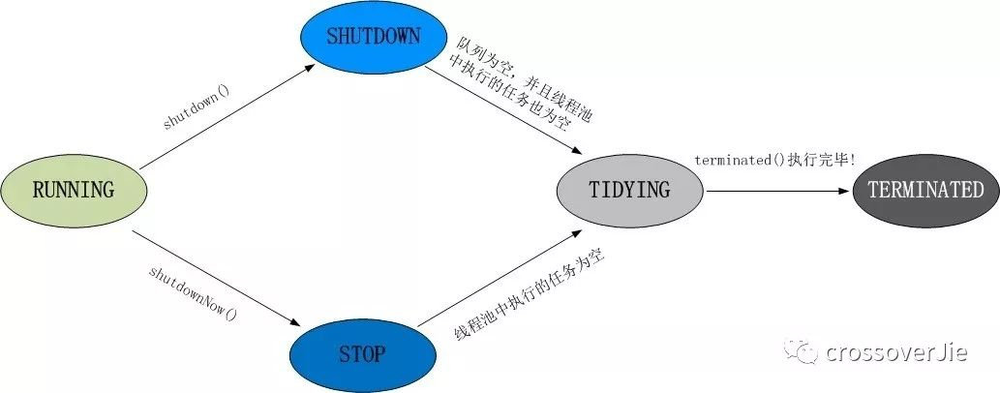
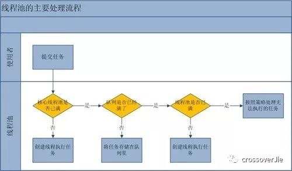

### 线程池原理

#### 前言
关于线程池，之前发布的《阿里巴巴java手册》里有一条：



可见线程池的重要性。

简单来说使用线程池有以下好处：

. 线程是稀缺资源，不能频繁的创建和销毁，每个工作线程都可以重复使用

. 解耦作用：线程创建与执行完全分开，方便维护

. 方便统一管理，可以根据系统的承受能力，调整线程池中工作线程的数量，防止因为消耗过多内存导致服务器崩溃

#### 线程池的创建
 
 谈到线程池就会想到池化技术，其中最核心的思想就是将宝贵的资源放到一个池子中，每次使用都从里面获取，用完之后又放回池子供其他任务使用。
 
 在jdk1.5之后推出了相关的api，常见的创建线程池方式有以下几种：
 
 **第一种方式：**
 
 . Executors.newCachedThreadPool(): 可缓存线程池，如果线程池长度超过处理需要，可灵活回收空闲线程，若无可回收，则新建线程
 
 . Executors.newFixedThreadPool(nThreads)：创建固定数量线程池
 
 . Executors.newSingleThreadPool()：创建单个线程的线程池
 
 . Executors.newScheduleThreadPool()：创建一个定长的线程池，而且支持定时以及周期性的任务执行
 
 看这种方式的源码可以发现：
 
 ```
 public static ExecutorService newCachedThreadPool() {
         return new ThreadPoolExecutor(0, Integer.MAX_VALUE,
                                       60L, TimeUnit.SECONDS,
                                       new SynchronousQueue());
     }
 ```
 
 实际上还是利用ThreadPoolExecutor类实现的。
 
**第二种方式(参数自定义):**

 ```
 public ThreadPoolExecutor(int corePoolSize,
                           int maximumPoolSize,
                           long keepAliveTime,
                           TimeUnit unit,
                           BlockingQueue<Runnable> workQueue,
                           ThreadFactory threadFactory,
                           RejectedExecutionHandler handler) 
 ```
 
 其中：
 
 **corePoolSize**：线程池核心线程数量
 
 **maximumPoolSize**：线程池最大线程数量
 
 **keepAliveTime**：当活跃线程数大于核心线程数时，空闲的多余线程最大存活时间
 
 **unit**：存活时间的单位
 
 **workQueue**：存放任务的队列
 
 **threadFactory**：产生线程的工厂
 
 **handler**：超出最大线程数和队列容量的任务的拒绝策略
 
 常见的拒绝策略有4种：
 1. **AbortPolicy**：**默认拒绝策略**。这种策略直接丢弃任务，抛出异常。
 2. **CallerRunsPolicy**：直接调用该execution的线程本身来执行。
 3. **DiscardPolicy**：直接丢弃任务，但不抛出异常
 4. **DiscardOldestPolicy**：丢弃工作队列中最老的任务，即工作队列头部的任务，然后重试执行任务
 
 了解了这几个参数再来看看实际的运用。通常都是使用
 
 ```
 threadPool.execute(new Job());
 ```
 
 这样的方式来提交一个任务到线程池中，所以核心的逻辑就是execute()函数了。
 
 在具体分析之前先了解下线程池中所定义的状态，这些状态和线程的执行密切相关：
 
 
 
 . **RUNNING**：自然是运行状态，指可以接受任务执行队列里的任务
 
 . **SHUTDOWN** 指调用了shutdown()方法，不再接受新任务了，但是队列里的任务得执行完毕
 
 . **STOP** 指调用了shutdownNow()方法，不再接受新任务，同时抛弃阻塞队列里的所有任务并中断所有正在执行的任务
 
 . **TIDYING**：所有任务都执行完毕，在调用shutdown()/shutdownNow()中都会尝试更新为这个状态
 
 . **TERMINATED**：终止状态，当执行terminated()后会更新为这个状态
 
 用图表示为：
 
  
  
  execute()方法是这样处理的，如下图所示：
  
  
  
  **如何配置线程？**
  
  上文提到的几个核心参数应该如何配置呢？
  有一点是肯定的，线程池并不是越大越好。
  通常是需要根据这批任务中行的性质来确定的：
  
  . **IO密集型任务**：由于线程并不是一直在运行，所以可以尽可能的多配置线程，比如CPU个数 * 2
  
  . **CPU密集型任务**：（大量复杂的运算）应当分配较少的线程，比如CPU个数相当的大小
  
  这些只是经验值
  
  **线程池的关闭**
  
  有运行任务自然也有关闭任务，从上文提到的5个状态就能看出如何关闭线程池。
  
  其实就两个方法：
     **shutdown()/shutdownNow()**
     
  但两者还是有区别的：
  
  . **shutdown()**：执行后停止接受新任务，会把队列的任务执行完毕
  
  . **shutdownNow()**：也是停止接受新任务，但会中断所有的任务，将线程池的状态变为stop
  
  两个方法都会中断线程，用户可以根据自己的业务自行判断是否需要相应中断。
  
  shutdownNow()要更简单粗暴，可以根据实际场景选择不同的方法。
  
  一般可以按照以下方式关闭线程池：
  
  ```
  long start = System.currentTimeMillis();
  for (int i = 0; i <= 5; i++) {
     pool.execute(new Job());
  }
  
  pool.shutdown();
  
  while (!pool.awaitTermination(1, TimeUnit.SECONDS)) {
     LOGGER.info("线程还在执行。。。");
  }
  long end = System.currentTimeMillis();
  LOGGER.info("一共处理了【{}】", (end - start));
  ```
  
  pool.awaitTermination(1, TimeUnit.SECONDS)会每隔一秒钟检查一次是否执行完毕(状态为TERMINATED)，当从while循环退出时就表明线程池已经完全终止了。