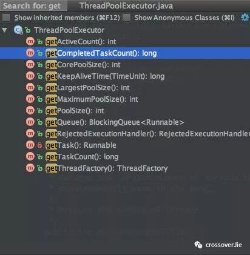

### SpringBoot使用线程池
  
  使用SpringBoot，可以使用Spring来管理线程池：
  
  ```
  @Configuration
  public class TreadPoolConfig {
  
      /**
       * 消费队列线程
       * @return
       */
      @Bean(value = "consumerQueueThreadPool")
      public ExecutorService buildConsumerQueueThreadPool(){
          ThreadFactory namedThreadFactory = new ThreadFactoryBuilder()
                  .setNameFormat("consumer-queue-thread-%d").build();
  
          ExecutorService pool = new ThreadPoolExecutor(5, 5, 0L, TimeUnit.MILLISECONDS,
                  new ArrayBlockingQueue(5), namedThreadFactory, new ThreadPoolExecutor.AbortPolicy());
          return pool ;
      }
  }
  ```
  
  使用时：
  
  ```
  @Resource(name = "consumerQueueThreadPool")
  private ExecutorService consumerQueueThreadPool;
  
  @Override
  public void execute() {
  
     //消费队列
     for (int i = 0; i < 5; i++) {
       consumerQueueThreadPool.execute(new ConsumerQueueThread());
     }
  }
  ```
  
  就是首先创建一个线程池的bean，在使用时直接从spring中取出即可。
  
  **监控线程池**
  
  谈到了SpringBoot，也可利用它的actuator组件来做线程池的监控。
  其实ThreadPool本身已经提供了不少api可以获取线程状态：
  
  
  
  只需要将这些信息暴露