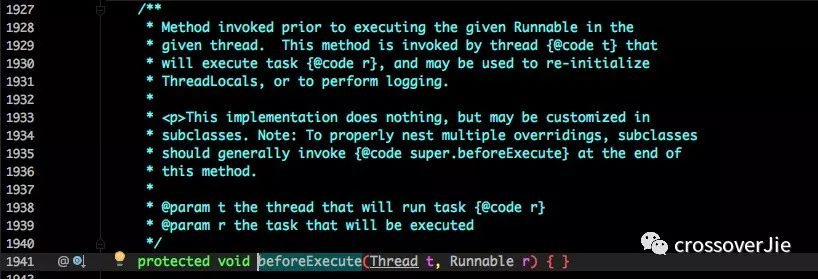
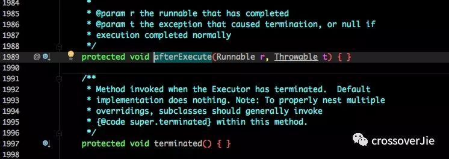
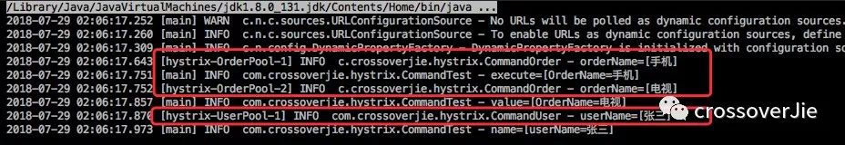
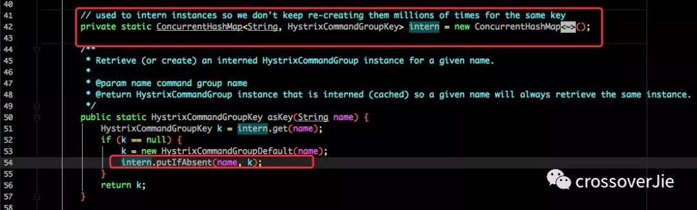

### SpringBoot使用线程池
  
  使用SpringBoot，可以使用Spring来管理线程池：
  
  ```
  @Configuration
  public class TreadPoolConfig {
  
      /**
       * 消费队列线程
       * @return
       */
      @Bean(value = "consumerQueueThreadPool")
      public ExecutorService buildConsumerQueueThreadPool(){
          ThreadFactory namedThreadFactory = new ThreadFactoryBuilder()
                  .setNameFormat("consumer-queue-thread-%d").build();
  
          ExecutorService pool = new ThreadPoolExecutor(5, 5, 0L, TimeUnit.MILLISECONDS,
                  new ArrayBlockingQueue(5), namedThreadFactory, new ThreadPoolExecutor.AbortPolicy());
          return pool ;
      }
  }
  ```
  
  使用时：
  
  ```
  @Resource(name = "consumerQueueThreadPool")
  private ExecutorService consumerQueueThreadPool;
  
  @Override
  public void execute() {
  
     //消费队列
     for (int i = 0; i < 5; i++) {
       consumerQueueThreadPool.execute(new ConsumerQueueThread());
     }
  }
  ```
  
  就是首先创建一个线程池的bean，在使用时直接从spring中取出即可。
  
  **监控线程池**
  
  谈到了SpringBoot，也可利用它的actuator组件来做线程池的监控。
  其实ThreadPool本身已经提供了不少api可以获取线程状态：
  
  
  
  只需要将这些信息暴露到SpringBoot的监控端点中，就可以在可视化页面查看当前的线程池状态。
  甚至可以继承线程池扩展其中的几个函数来自定义监控逻辑：
  
   
   
   
   看这些明名称和定义就知道，这是让子类来实现的。
   可以在线程执行前、后、终止状态执行自定义逻辑。
   
   **线程池隔离**
   
   线程池对燃美好，但也会带来一些问题：
   
   如果很多业务都依赖于同一个线程池，当其中一个业务因为各种不可控的原因消耗了所有的线程，导致线程池全部占满。这样其他业务也就不能正常运转了，这对系统的打击是巨大的。
   
   比如Tomcat接受请求的线程池，假设其中一些响应特别慢，线程资源得不到回收释放；线程池慢慢被占满，最坏的情况就是整个应用都不能提供服务。
   
   所以需要将**线程池进行隔离**。
   
   通常的做法是按照业务进行划分：
   
   比如下单的任务用一个线程池，获取数据的任务用另一个线程池。这样即使其中一个穿线问题把线程池耗尽，那也不会影响其他的任务运行。
   
   **Hystrix隔离**
   
   这样的需求Hystrix已经实现了。
   Hystrix是一款开源的容错插件，具有**依赖隔离、系统容错降级**等功能。
   
   下面看看Hystrix简单的应用：
   首先需要定义两个线程池，分别用于执行订单、处理用户。
   
   ```
   public class CommandOrder extends HystrixCommand<String> {
   
       private final static Logger LOGGER = LoggerFactory.getLogger(CommandOrder.class);
   
       private String orderName;
   
       public CommandOrder(String orderName) {
   
           super(Setter.withGroupKey(
                   //服务分组
                   HystrixCommandGroupKey.Factory.asKey("OrderGroup"))
                   //线程分组
                   .andThreadPoolKey(HystrixThreadPoolKey.Factory.asKey("OrderPool"))
   
                   //线程池配置
                   .andThreadPoolPropertiesDefaults(HystrixThreadPoolProperties.Setter()
                           .withCoreSize(10)
                           .withKeepAliveTimeMinutes(5)
                           .withMaxQueueSize(10)
                           .withQueueSizeRejectionThreshold(10000))
   
                   .andCommandPropertiesDefaults(
                           HystrixCommandProperties.Setter()
                                   .withExecutionIsolationStrategy(HystrixCommandProperties.ExecutionIsolationStrategy.THREAD))
           )
           ;
           this.orderName = orderName;
       }
   
   
       @Override
       public String run() throws Exception {
   
           LOGGER.info("orderName=[{}]", orderName);
   
           TimeUnit.MILLISECONDS.sleep(100);
           return "OrderName=" + orderName;
       }
   
   
   }
   
   
   public class CommandUser extends HystrixCommand<String> {
   
       private final static Logger LOGGER = LoggerFactory.getLogger(CommandUser.class);
   
       private String userName;
   
       public CommandUser(String userName) {
   
           super(Setter.withGroupKey(
                   //服务分组
                   HystrixCommandGroupKey.Factory.asKey("UserGroup"))
                   //线程分组
                   .andThreadPoolKey(HystrixThreadPoolKey.Factory.asKey("UserPool"))
   
                   //线程池配置
                   .andThreadPoolPropertiesDefaults(HystrixThreadPoolProperties.Setter()
                           .withCoreSize(10)
                           .withKeepAliveTimeMinutes(5)
                           .withMaxQueueSize(10)
                           .withQueueSizeRejectionThreshold(10000))
   
                   //线程池隔离
                   .andCommandPropertiesDefaults(
                           HystrixCommandProperties.Setter()
                                   .withExecutionIsolationStrategy(HystrixCommandProperties.ExecutionIsolationStrategy.THREAD))
           )
           ;
           this.userName = userName;
       }
   
   
       @Override
       public String run() throws Exception {
   
           LOGGER.info("userName=[{}]", userName);
   
           TimeUnit.MILLISECONDS.sleep(100);
           return "userName=" + userName;
       }
   }
   ```
   
   然后模拟运行：
   ```
   public static void main(String[] args) throws Exception {
        CommandOrder commandPhone = new CommandOrder("手机");
        CommandOrder command = new CommandOrder("电视");

        //阻塞方式执行
        String execute = commandPhone.execute();
        LOGGER.info("execute=[{}]", execute);

        //异步非阻塞方式
        Future queue = command.queue();
        String value = queue.get(200, TimeUnit.MILLISECONDS);
        LOGGER.info("value=[{}]", value);

        CommandUser commandUser = new CommandUser("张三");
        String name = commandUser.execute();
        LOGGER.info("name=[{}]", name);
    }
   ```
   
   运行结果：
   
   
   
   可以看到：两个任务分成了两个线程池运行，他们之间互不干扰。
   
   获取任务结果支持同步阻塞和异步非阻塞方式，可自行选择。
   
   实现原理很容易猜到：
   
   **利用一个Map来存放不同业务对应对应的线程池。**
   
   通过刚才的构造函数也能证明：
   
   
   
   还要注意的一点是：
   
   自定义的Command并不是一个单例，每次执行需要new一个实例，不然会报This instance can only be executed once. Please instantiate a new instance.异常。
   
   **总结**
   
   池化技术确实在平时应用广泛，熟练掌握能提高不少效率。  
  
  
  
  
  
  
  