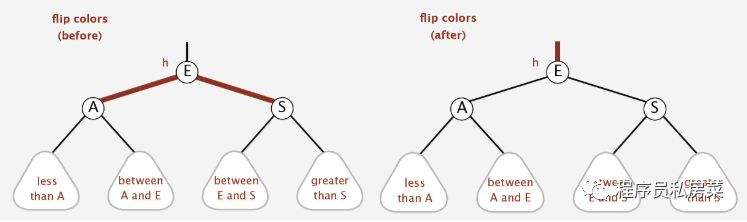
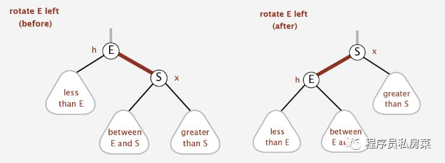
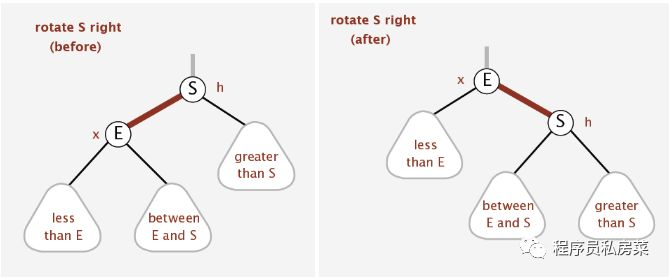

### 红黑树

**1. 红-黑树的特征**

主要有两个特征：

1. 节点都有颜色；

2. 在插入和删除的过程中，要遵循保持这些颜色的不同排列的规则

首先第一个特征很好解决，在节点类中添加一个数据字段，例如boolean型字段，以此来表示节点的颜色信息。

第二个特征比较复杂，红-黑树有它的几个规则，如果遵循这些规则，那么树就是平衡的。红-黑树的主要规则如下：

**1. 每个节点要么是红色，要么是黑色；**

**2. 根节点总是黑色的；**

**3. 每个叶子节点是黑色的；**

**4. 如果一个节点是红色，则它的子节点必须是黑色的（反之不一定）；**

**5. 从一个节点到该节点的子孙节点（叶节点或空子节点）的所有路径上包含相同数目的黑色节点（即相同的黑色高度）。**

在红-黑树中插入的节点都是红色的，这不是偶然的，因为插入一个红色节点比插入一个黑色节点违背红-黑规则的可能性更小。

原因是：插入黑色节点总会改变黑色高度(违背规则5)，但是插入红色节点只有一半的机会违背规则4。

另外违背规则4比违背规则5要更容易修正。当插入一个新的节点时，可能会破坏这种平衡性，那么红-黑树是如何修正的呢？

**2. 平衡性的修正**

红-黑树主要通过三种方式对平衡进行修正，改变节点颜色、左旋和右旋。这看起来有点抽象，分别来介绍一下。

**2.1 变色**

改变节点颜色比较容易理解，因为它违背了规则4。

假设现在有个节点E，然后插入节点A和节点S，节点A在左子节点，S在右子节点，目前是平衡的。

如果此时再插入一个节点，那么就出现不平衡了，因为红色节点的子节点必须为黑色，但是新插的节点是红色的。

所以这时候就必须改变节点颜色了。所以将根的两个子节点从红色变为黑色（至于为什么都要变，下面插入的时候会简单介绍），将父节点从黑色变为红色。

可以用如下示意图表示一下：

  
  
  **2.2 左旋**
  
  通过左旋操作用于将一个向右倾斜的红色链接旋转为向左链接。示意图如下：
  
  
  
  左旋的动态示意图，可以方便理解为：
  
  
  
  

  
  **2.3 右旋**
  
  右旋和左旋刚好相反，示意图如下：
  
  
  
  

  
  

