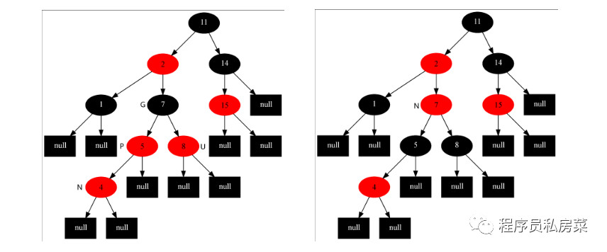
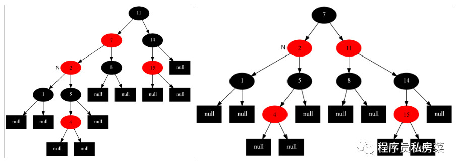

### 红黑树

#### 1. 红-黑树的特征

主要有两个特征：

1. 节点都有颜色；

2. 在插入和删除的过程中，要遵循保持这些颜色的不同排列的规则

首先第一个特征很好解决，在节点类中添加一个数据字段，例如boolean型字段，以此来表示节点的颜色信息。

第二个特征比较复杂，红-黑树有它的几个规则，如果遵循这些规则，那么树就是平衡的。红-黑树的主要规则如下：

**1. 每个节点要么是红色，要么是黑色；**

**2. 根节点总是黑色的；**

**3. 每个叶子节点是黑色的；**

**4. 如果一个节点是红色，则它的子节点必须是黑色的（反之不一定）；**

**5. 从一个节点到该节点的子孙节点（叶节点或空子节点）的所有路径上包含相同数目的黑色节点（即相同的黑色高度）。**

在红-黑树中插入的节点都是红色的，这不是偶然的，因为插入一个红色节点比插入一个黑色节点违背红-黑规则的可能性更小。

原因是：插入黑色节点总会改变黑色高度(违背规则5)，但是插入红色节点只有一半的机会违背规则4。

另外违背规则4比违背规则5要更容易修正。当插入一个新的节点时，可能会破坏这种平衡性，那么红-黑树是如何修正的呢？

#### 2. 平衡性的修正

红-黑树主要通过三种方式对平衡进行修正，改变节点颜色、左旋和右旋。这看起来有点抽象，分别来介绍一下。

**2.1 变色**

改变节点颜色比较容易理解，因为它违背了规则4。

假设现在有个节点E，然后插入节点A和节点S，节点A在左子节点，S在右子节点，目前是平衡的。

如果此时再插入一个节点，那么就出现不平衡了，因为红色节点的子节点必须为黑色，但是新插的节点是红色的。

所以这时候就必须改变节点颜色了。所以将根的两个子节点从红色变为黑色（至于为什么都要变，下面插入的时候会简单介绍），将父节点从黑色变为红色。

可以用如下示意图表示一下：

  
  
  **2.2 左旋**
  
  通过左旋操作用于将一个向右倾斜的红色链接旋转为向左链接。示意图如下：
  
  
  
  左旋的动态示意图，可以方便理解为：
  
  
  
  **2.3 右旋**
  
  右旋和左旋刚好相反，示意图如下：
  
  
  
  右旋动态图如下：
  
  

  
  #### 3. 红-黑树的操作
  
  红-黑树的基本操作是添加、删除和旋转。对红-黑树进行添加或删除后，可能会破坏其平衡性，会用到哪种旋转方式去修正呢？
  
  首先对红-黑树的节点做一下介绍，然后分别对左旋和右旋的具体实现做一下分析，最后可以探讨一下红黑树的具体操作。
  
  **3.1 红-黑树的节点**
  
  红-黑树是对二叉搜索树的改进，所以其节点与二叉搜索树是差不多的，只不过在它基础上增加了一个boolean型变量来表示节点的颜色。
  
  具体看RBNode类：
  
  ```
  public class RBNode <t <="" span="">extends Comparable> {
    
     boolean color;    //颜色
     T key;   //关键字(键值)
     RBNode left;    //左子节点
     RBNode right;    //右子节点
     RBNode parent;   //父节点
            
     public RBNode(T key, boolean color, RBNode parent, RBNode left, RBNode right) {
        this.key = key;
        this.color = color;
        this.parent = parent;
        this.left = left;
        this.right = right;
     }
    
     public T getKey() {
        return key;
     }
            
     public String toString() {
        return "" + key + (this.color == RED? "R" : "B");
     }
  }
  ```
  
  **3.2 左旋的具体实现**
  
  上面对左旋的概念已经有了感性的认识，不再赘述，下面分析一下左旋的具体实现：
  
  ```
  /*************对红黑树节点x进行左旋操作 ******************/
      /*
       * 左旋示意图：对节点x进行左旋
       *     p                       p
       *    /                       /
       *   x                       y
       *  / \                     / \
       * lx  y      ----->       x  ry
       *    / \                 / \
       *   ly ry               lx ly
  
       * 左旋做了三件事：
       * 1. 将y的左子节点赋给x的右子节点,并将x赋给y左子节点的父节点(y左子节点非空时)
       * 2. 将x的父节点p(非空时)赋给y的父节点，同时更新p的子节点为y(左或右)
       * 3. 将y的左子节点设为x，将x的父节点设为y
       */
  private void leftRotate(RBNode x) {
     //1. 将y的左子节点赋给x的右子节点，并将x赋给y左子节点的父节点(y左子节点非空时)
     RBNode y = x.right;
     x.right = y.left;
  
     if (y.left != null)
        y.left.parent = x;
          
     //2. 将x的父节点p(非空时)赋给y的父节点，同时更新p的子节点为y(左或右)
     y.parent = x.parent;
          
     if (x.parent == null) {
        this.root = y;     //如果x的父节点为空，则将y设为父节点
     } else {
        if (x == x.parent.left)   //如果x是左子节点
           x.parent.left = y;    //则也将y设为左子节点
        else
           x.parent.right = y;    //否则将y设为右子节点
     }
          
     //3. 将y的左子节点设为x，将x的父节点设为y
     y.left = x;
     x.parent = y;
  }
  ```
  
  **3.3 右旋的具体实现**
  
  上面对右旋的概念有了感性的认识，这里不在赘述，可以从以下代码中看看右旋的具体实现：
    
  ```
  /*************对红黑树节点y进行右旋操作 ******************/
      /*
       * 右旋示意图：对节点y进行右旋
       *        p                   p
       *       /                   /
       *      y                   x
       *     / \                 / \
       *    x  ry   ----->      lx  y
       *   / \                     / \
       * lx  rx                   rx ry
  
       * 右旋做了三件事：
       * 1. 将x的右子节点赋给y的左子节点,并将y赋给x右子节点的父节点(x右子节点非空时)
       * 2. 将y的父节点p(非空时)赋给x的父节点，同时更新p的子节点为x(左或右)
       * 3. 将x的右子节点设为y，将y的父节点设为x
       */
       
  private void rightRotate(RBNode y) {
          
     //1. 将y的左子节点赋给x的右子节点，并将x赋给y左子节点的父节点(y左子节点非空时)
     RBNode x = y.left;
     y.left = x.right;
          
     if (x.right != null)
        x.right.parent = y;
          
     //2. 将x的父节点p(非空时)赋给y的父节点，同时更新p的子节点为y(左或右)
     x.parent = y.parent;
          
     if (y.parent == null) {
        this.root = x;     //如果x的父节点为空，则将y设为父节点
     } else {
        if (y == y.parent.right)    //如果x是左子节点
           y.parent.right = x;  //则也将y设为左子节点
        else
           y.parent.left = x;  //否则将y设为右子节点
     }
          
     //3. 将y的左子节点设为x，将x的父节点设为y
     x.right = y;
     y.parent = x;
  }
  ```
  
  **3.4 插入操作**
  
  分析完红-黑树中主要的旋转操作，接下来开始分析常见的插入、删除等操作。
  
  这里先分析插入操作。由于红-黑树是二叉搜索树的改进，所以插入操作的前半工作是相同的，即先找到待插入的位置，再将节点插入。
  
  先来看看插入的前半段代码：
  
  ```
  /*********************** 向红黑树中插入节点 **********************/
      public void insert(T key) {
          RBNode node = new RBNode(key, RED, null, null, null);
          if (node != null)
              insert(node);
      }
  
      //将节点插入到红黑树中，这个过程与二叉搜索树是一样的
      private void insert(RBNode node) {
          RBNode current = null;    //表示最后node的父节点
          RBNode x = this.root;     //用来向下搜索用的
  
          //1. 找到插入的位置
          while (x != null) {
              current = x;
              int cmp = node.key.compareTo(x.key);
              if (cmp < 0)
                  x = x.left;
              else
                  x = x.right;
          }
  
          node.parent = current;   //找到了位置，将当前current作为node的父节点
          
          //2. 接下来判断node是插在左子节点还是右子节点
          if (current != null) {
              int cmp = node.key.compareTo(current.key);
              if (cmp < 0)
                  current.left = node;
              else
                  current.right = node;
          } else {
              this.root = node;
          }
          
          //3. 将它重新修整为一颗红黑树
          insertFixUp(node);
      }
  ```
  
  这与二叉搜索树中实现的思路是一模一样，不再赘述，主要看看方法里面最后一步insertFixUp操作。
  
  因为插入后可能会导致树的不平衡，insertFixUp方法里主要是分情况讨论，分析何时变色，何时左旋，何时右旋。
  
  如果是第一次插入，由于原树为空，所以只会违反红-黑树的规则2，所以只要把根节点涂黑即可；
  如果插入节点的父节点是黑色的，那不会违背红-黑树的规则，什么也不需要做；
  
  **但是遇到如下三种情况时，就要开始变色和旋转：**
  
  **1. 插入节点的父节点和其叔叔节点（祖父节点的另一个子节点）均为红色的；
  2. 插入节点的父节点是红色，叔叔节点是黑色，且插入节点是其父节点的右子节点；
  3. 插入节点的父节点是红色，叔叔节点是黑色，且插入节点是其父节点的左子节点。**
  
  下面挨个分析这三种情况，然后再给出实现代码。
  
  对于情况1：**插入节点的父节点和其叔叔节点（祖父节点的另一个子节点）均为红色的。**
  
  此时，肯定存在祖父节点，但是不知道父节点是其左子节点还是右子节点，但是由于对称性，只需要讨论一边的情况，另一种情况自然与之对应。
  
  这里考虑父节点是祖父节点的左子节点的情况，如下左图所示：
  
  
  
  对于这种情况，要做的操作有：
  
  **. 将当前节点(4)的父节点(5)和叔叔节点(8)涂黑**
  
  **. 将祖父节点(7)涂红，变成上右图所示的情况**
  
  **. 再将当前节点指向其祖父节点，再次从新的当前节点开始算法(具体看下面的程序)**
  
  这样上右图就变成情况2了。
  
  对于情况2：**插入节点的父节点是红色，叔叔节点是黑色，且插入节点是其父节点的右子节点。**
  
  要做的操作有：**将当前节点(7)的父节点(2)作为新的节点**，以新的当前节点为支点做**左旋**操作。
  
  完成后如左下图所示，这样就变成情况3了。
  
  
  
  对于情况3：**插入节点的父节点是红色，叔叔节点是黑色，且插入节点是其父节点的左子节点。**
  
  现在要做的操作是：将当前节点的父节点(7)涂黑，将祖父节点(11)涂红，在祖父节点为支点做右旋操作。
  
  最后**把根节点涂黑**，整个红-黑树重新恢复了平衡，如右上图所示。
  
  至此，插入操作完成！
  
  可以看出，如果是从情况1开始发生的，必然会走完情况2和3，也就是说这是一整个流程。
  
  当然，世纪钟可能不一定会从情况1发生，如果从情况2开始发生，那再走个情况3即可完成调整，如果直接只要调整情况3，那么前两种情况均不需要调整了。
  
  故变色和旋转之间的先后关系可以表示为：**变色 -> 左旋 -> 右旋**。
  
  至此，完成了全部的插入操作。下面看看insertFixUp方法中的具体实现(可以结合上面的分析图，更加容易理解)：
  
  ```
      private void insertFixUp(RBNode node) {
          RBNode parent, gparent;    //定义父节点和祖父节点
  
          //需要修整的条件：父节点存在，且父节点的颜色是红色
          while (((parent = parentOf(node)) != null) && isRed(parent)) {
              gparent = parentOf(parent);     //获得祖父节点
  
              //若父节点是祖父节点的左子节点，下面else与其相反
              if (parent == gparent.left) {
                  RBNode uncle = gparent.right;    //获得叔叔节点
  
                  //case1: 叔叔节点也是红色
                  if (uncle != null && isRed(uncle)) {
                      setBlack(parent);    //把父节点和叔叔节点涂黑
                      setBlack(uncle);
                      setRed(gparent);   //把祖父节点涂红
                      node = gparent;     //将位置放到祖父节点处
                      continue;      //继续while，重新判断
                  }
                  
                  //case2: 叔叔节点是黑色，且当前节点是右子节点
                  if (node == parent.right) {
                      leftRotate(parent);     //从父节点处左旋
                      RBNode tmp = parent;     //然后将父节点和自己调换一下，为下面右旋做准备
                      parent = node;
                      node = tmp;
                  }
                  
                  //case3: 叔叔节点是黑色，且当前节点是左子节点
                  setBlack(parent);
                  setRed(gparent);
                  rightRotate(gparent);
              } else {    //若父节点是祖父节点的右子节点,与上面的完全相反，本质一样的
                  RBNode uncle = gparent.left;
                  
                  //case1: 叔叔节点也是红色
                  if (uncle != null & isRed(uncle)) {
                      setBlack(parent);
                      setBlack(uncle);
                      setRed(gparent);
                      node = gparent;
                      continue; 
                  }
                  
                  //case2: 叔叔节点是黑色的，且当前节点是左子节点
                  if (node == parent.left) {
                      rightRotate(parent);
                      RBNode tmp = parent;
                      parent = node;
                      node = tmp;
                  }
  
                 //case3: 叔叔节点是黑色的，且当前节点是右子节点
                  setBlack(parent);
                  setRed(gparent);
                  leftRotate(gparent);
              }
          }
  
          //将根节点设置为黑色
          setBlack(this.root);
      }
  ```
 


